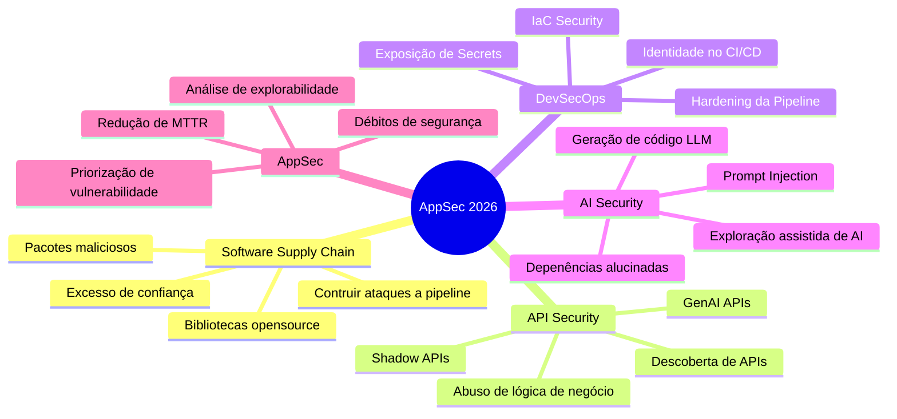

```mermaid
mindmap
  root((AppSec 2026))
    Software Supply Chain
      Bibliotecas opensource
      Excesso de confiança
      Pacotes maliciosos
      Contruir ataques a pipeline

    API Security
      Shadow APIs
      Descoberta de APIs
      Abuso de lógica de negócio
      GenAI APIs

    DevSecOps
      Exposição de Secrets 
      Identidade no CI/CD
      IaC Security
      Hardening da Pipeline

    AI Security
      Geração de código LLM
      Depenências alucinadas
      Prompt Injection
      Exploração assistida de AI

    AppSec
      Débitos de segurança
      Priorização de vulnerabilidade
      Redução de MTTR 
      Análise de explorabilidade
```
